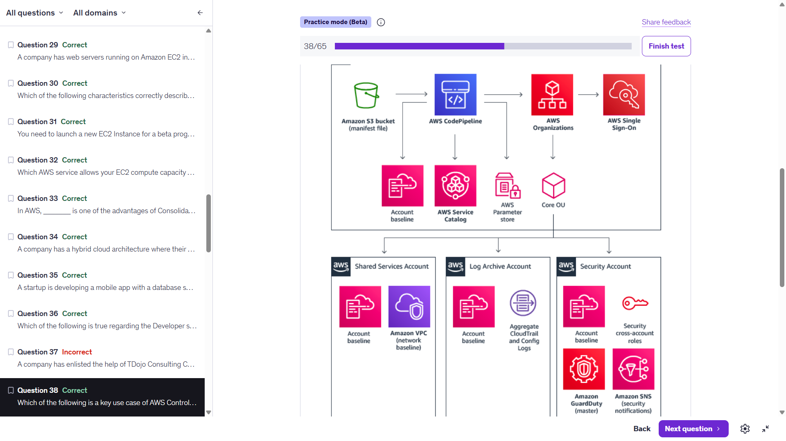

# AWS Control Tower — Landing Zone Architecture

---

## What Is This?

This is an **AWS Control Tower landing zone architecture** — the blueprint for how a large enterprise sets up and governs a secure, multi-account AWS environment from scratch in an automated, standardized way. Control Tower automates the entire build process so every account that gets created follows the same security and compliance baseline automatically.

---

## The Top Row — The Automation Pipeline

Think of the top row as the **engine that builds everything below it**. It reads a blueprint and automatically provisions the entire account structure.

### Amazon S3 Bucket (manifest file)
The starting point. A configuration file stored in S3 defines what the entire environment should look like — which accounts to create, what policies to apply, what services to enable. This is the **blueprint**.

### AWS CodePipeline
Reads the manifest file from S3 and **orchestrates the entire setup process automatically**. It triggers the creation of accounts, applies baselines, and provisions the three specialized accounts in the bottom row. CodePipeline is the automation engine — without it, all of this would have to be done manually.

### AWS Organizations
CodePipeline uses Organizations to **create and manage the account hierarchy** — the Organizational Units (OUs) and individual accounts you see in the bottom row. Organizations is what allows a single management account to govern many child accounts with policies applied from the top down.

### AWS Single Sign-On (SSO)
Sets up **centralized login** so users across the entire organization can access any account with one set of credentials. Instead of managing separate usernames and passwords per account, SSO gives developers, admins, and security teams one login that works everywhere.

---

## What CodePipeline Provisions in Parallel

As CodePipeline runs, it simultaneously sets up three supporting components:

### Account Baseline
A standardized set of **security configurations and guardrails** that get applied to every account that gets created. Think of it as the default security posture — every new account starts with these settings locked in.

### AWS Service Catalog
A **pre-approved catalog of services and products** that teams within the organization are allowed to deploy. This prevents engineers from spinning up unapproved or insecure resources. Governance through allowed options.

### AWS Parameter Store (Systems Manager)
Stores **configuration values, secrets, and parameters** that accounts need to function — things like database connection strings, environment variables, and API endpoints. Centralizing these means accounts can pull config values securely rather than hardcoding them.

---

## The Bottom Row — The Three Specialized Accounts

This is what gets built. Three purpose-built accounts, each with a specific job, all governed consistently from the top down through Organizations.

### Shared Services Account
Provides **common infrastructure** that other accounts in the organization can use. Contains two components:
- **Account baseline** — the same standard security settings applied to all accounts
- **Amazon VPC (network baseline)** — a pre-configured, standardized VPC network that other accounts can connect to or reference. Shared networking infrastructure lives here so every team doesn't have to build their own from scratch.

### Log Archive Account
A **single centralized repository** where logs from every account in the organization flow into and are stored. Contains:
- **Account baseline** — standard security settings
- **Aggregate CloudTrail and Config Logs** — every API call and every resource configuration change across all accounts gets sent here automatically. Critical for compliance, audits, and forensics. Having one place for all logs means security teams don't have to go hunting through individual accounts.

### Security Account
The **security operations hub** for the entire organization. Contains:
- **Account baseline** — standard security settings
- **Security cross-account roles** — IAM roles that allow security team members to access any account in the organization when they need to investigate or respond to an incident, without needing individual credentials for each account
- **Amazon GuardDuty (master)** — GuardDuty runs in master mode here, which means it aggregates threat intelligence and findings from every account in the organization into one place. The security team sees threats across the entire org from a single pane of glass
- **Amazon SNS (security notifications)** — When GuardDuty or other security tools detect a threat, SNS broadcasts the alert to the security team immediately

---

## The Full Flow — Plain English

> A manifest file in S3 defines what the environment should look like → CodePipeline reads it and uses Organizations to create accounts, SSO to set up centralized access, and Service Catalog/Parameter Store/baselines to standardize everything → the result is three purpose-built accounts (Shared Services, Log Archive, Security) all governed consistently from the top down, with every new account automatically inheriting the same security baseline.

---

## Key Concepts for the Exam and Interviews

| Concept | What to Know |
|---|---|
| **Landing zone** | A pre-configured, secure, multi-account AWS environment. Control Tower automates building and governing it |
| **AWS Control Tower** | The service that sets up and governs the landing zone. Uses Organizations, SSO, Service Catalog, and CloudFormation under the hood |
| **Organizational Units (OUs)** | Groupings of accounts within Organizations. Policies applied to an OU apply to all accounts inside it |
| **GuardDuty master mode** | Running GuardDuty in one account that aggregates findings from all member accounts — one security view across the whole org |
| **Log Archive account** | AWS best practice pattern — centralize all logs in a dedicated account so they can't be tampered with by other accounts |
| **Service Catalog** | Governance tool — defines what teams are allowed to deploy, preventing unapproved or insecure resource creation |

---

## Interview-Ready Summary

> "AWS Control Tower sets up a landing zone — a secure, governed, multi-account environment. It uses a manifest file in S3 and CodePipeline to automate the provisioning of account baselines, SSO, and three specialized accounts: a Shared Services account for common networking infrastructure, a Log Archive account that centralizes CloudTrail and Config logs from across the entire organization, and a Security account that runs GuardDuty in master mode to aggregate threat findings from every account and broadcasts alerts via SNS."

That's cloud architect language. Use it.