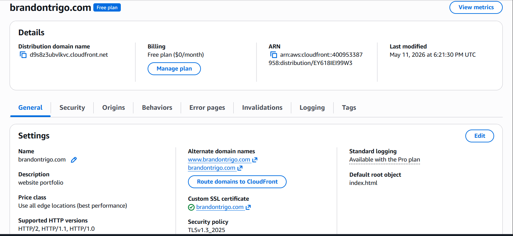
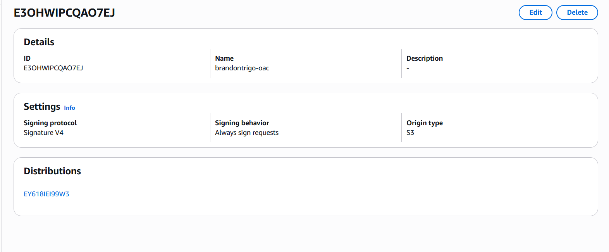
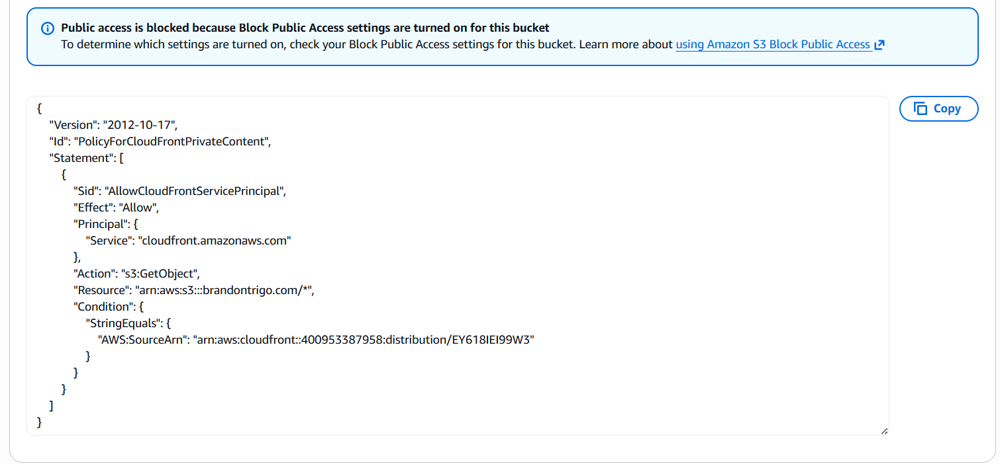
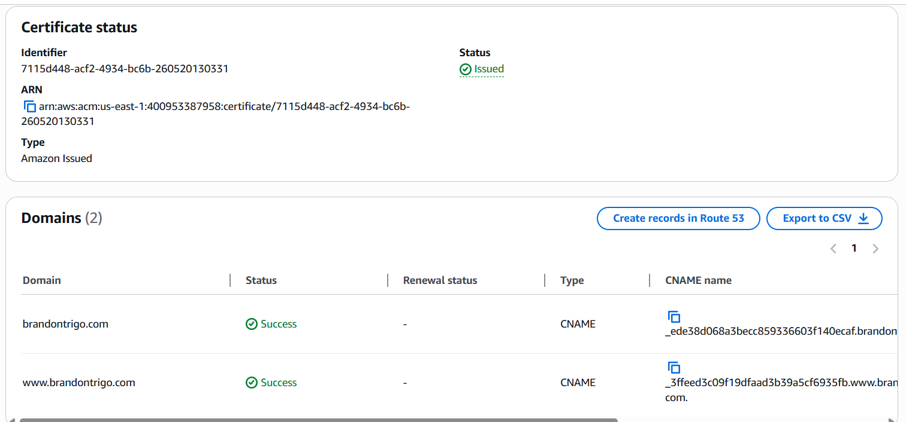
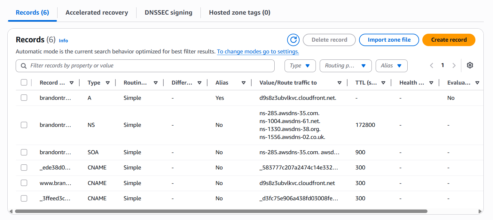
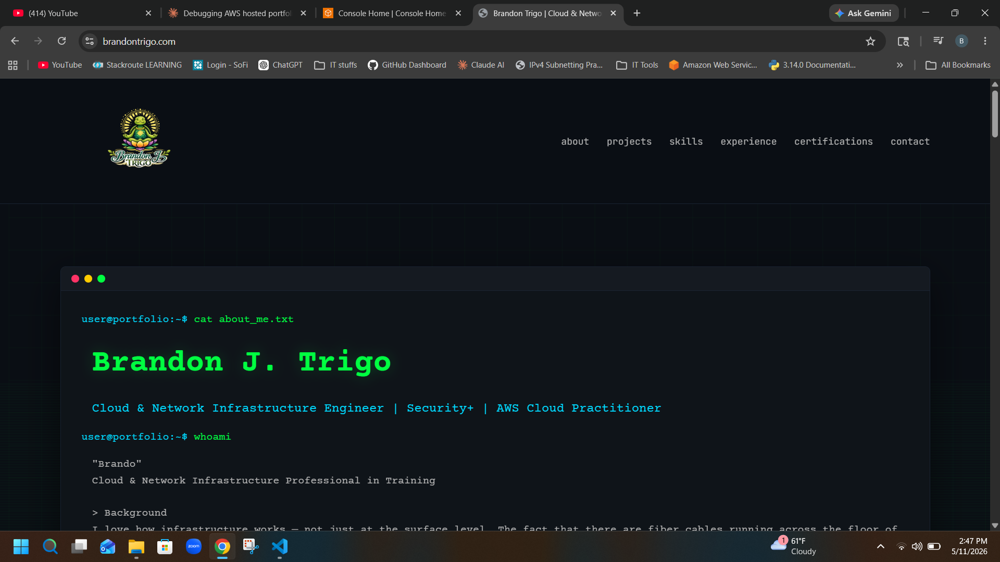

# Deploying a Secure Static Portfolio Website on AWS

**Live site:** [https://brandontrigo.com](https://brandontrigo.com)

---

## Project Overview

This project covers the end-to-end deployment of a secure, static portfolio website hosted entirely on AWS using a serverless architecture. The site is served over HTTPS with a custom domain, globally distributed via a CDN, and locked down so that the S3 bucket storing the files is never directly accessible to the public internet.

This is not just "upload files to S3 and make them public." The architecture follows AWS best practices for static site hosting — S3 stays private, CloudFront handles all traffic, and access is controlled through a signed request mechanism called OAC (Origin Access Control).

---

## Architecture

```
Visitor
   │
   ▼
Route 53 (DNS — ALIAS record → CloudFront)
   │
   ▼
CloudFront Distribution (CDN + HTTPS)
   │   ├── ACM Certificate (SSL/TLS — enforces HTTPS)
   │   ├── CloudFront Function (URI rewrite: / → /index.html)
   │   └── OAC (signs every request to S3 with SigV4)
   │
   ▼
S3 Bucket (private — no public access)
   ├── index.html
   ├── css/style.css
   ├── js/script.js
   └── images/turtle-meditation.png
```

Traffic flow: A visitor hits `brandontrigo.com` → Route 53 resolves it to the CloudFront distribution → CloudFront checks its cache, and if needed, makes a signed request to S3 via OAC → S3 returns the file → CloudFront serves it to the visitor over HTTPS.

The S3 bucket has no public access. It will only serve files to CloudFront, and only when the request is signed by the correct OAC. Any direct request to S3 returns `AccessDenied`.

---

## AWS Services Used

### Amazon S3
S3 (Simple Storage Service) is AWS's object storage service. Files are stored as objects inside a bucket. In this project, S3 acts as the origin — it stores the static files that make up the portfolio site.

**Why S3:** It's cheap, durable, and purpose-built for storing and retrieving files at scale. For a static site, there's no need for a server — S3 holds the files and CloudFront serves them.

**Key configuration decisions:**
- Block Public Access is **ON** — the bucket is completely private. No one can access files directly via the S3 URL.
- Static website hosting is **OFF** — this feature is only needed if you're using the S3 website endpoint directly. Since traffic goes through CloudFront using the REST endpoint, static website hosting is unnecessary and can conflict with OAC.
- Files are stored at the **bucket root** — `index.html`, `css/`, `js/`, and `images/` are at the top level of the bucket, not nested inside any subfolder. CloudFront requests files by path, so the structure in S3 must match what CloudFront expects.


---

### Amazon CloudFront
CloudFront is AWS's CDN (Content Delivery Network). It caches content at edge locations around the world so that visitors get files served from a location geographically close to them, reducing latency.

**Why CloudFront:** A static site hosted in a single S3 bucket in `us-east-1` would be slow for visitors in Europe or Asia. CloudFront solves this by caching the files globally. It also handles HTTPS termination, meaning visitors get a secure connection without needing any server-side configuration.

**Key configuration decisions:**
- **Alternate domain names:** `brandontrigo.com` and `www.brandontrigo.com` — tells CloudFront to accept traffic for these domains.
- **Default root object:** `index.html` — when someone visits the root of the domain (`/`), CloudFront automatically serves `index.html`.
- **Origin:** S3 REST endpoint (`brandontrigo.com.s3.us-east-1.amazonaws.com`) — not the website endpoint. The REST endpoint is required for OAC to work.
- **Security policy:** TLSv1.3_2025 — enforces modern TLS only.
- **OAC attached:** `brandontrigo-oac` — all requests CloudFront makes to S3 are signed (see OAC section below).



---

### Origin Access Control (OAC)
OAC is the mechanism that allows CloudFront to access a private S3 bucket. When OAC is attached to a CloudFront distribution, every request CloudFront makes to S3 is signed using AWS Signature Version 4 (SigV4). S3 then verifies that signature against the bucket policy before serving the file.

**Why OAC instead of making S3 public:** Making the bucket public would mean anyone who discovers the S3 URL can access your files directly, bypassing CloudFront entirely. OAC locks the bucket to CloudFront only — S3 will only respond to signed requests from the specific CloudFront distribution you configure.

**OAC vs OAI:** OAI (Origin Access Identity) is the legacy version of this feature. AWS now recommends OAC for all new deployments. OAC supports more S3 features, uses stronger signing, and is the current AWS best practice.

**How it works:** The bucket policy includes a condition that checks `AWS:SourceArn` — it must match the ARN of the specific CloudFront distribution. Even if someone created their own CloudFront distribution and pointed it at your bucket, S3 would reject the request because the ARN wouldn't match.



---

### S3 Bucket Policy
The bucket policy is the IAM policy attached directly to the S3 bucket. It defines who is allowed to perform what actions on the bucket and its objects.

**In this project**, the bucket policy grants exactly one permission: `s3:GetObject` (read files) to the CloudFront service principal (`cloudfront.amazonaws.com`), but only when the request comes from the specific CloudFront distribution via OAC.

```json
{
    "Version": "2012-10-17",
    "Id": "PolicyForCloudFrontPrivateContent",
    "Statement": [
        {
            "Sid": "AllowCloudFrontServicePrincipal",
            "Effect": "Allow",
            "Principal": {
                "Service": "cloudfront.amazonaws.com"
            },
            "Action": "s3:GetObject",
            "Resource": "arn:aws:s3:::brandontrigo.com/*",
            "Condition": {
                "StringEquals": {
                    "AWS:SourceArn": "arn:aws:cloudfront::[ACCOUNT_ID]:distribution/[DISTRIBUTION_ID]"
                }
            }
        }
    ]
}
```

Everything else is denied by default. No other AWS account, no other CloudFront distribution, and no public internet request can read from this bucket.



---

### AWS Certificate Manager (ACM)
ACM is AWS's managed SSL/TLS certificate service. It issues and automatically renews certificates that prove to a visitor's browser that they're talking to the real `brandontrigo.com` and not an impersonator. This is what enables HTTPS.

**Why ACM:** Certificates from ACM are free and auto-renew. For use with CloudFront, the certificate must be issued in `us-east-1` (N. Virginia) regardless of where the rest of your infrastructure is — this is a CloudFront-specific requirement.

**Validation method:** DNS validation. ACM provides CNAME records that you add to your Route 53 hosted zone. Once ACM sees those records, it confirms you own the domain and issues the certificate. These CNAME records stay in Route 53 permanently so ACM can auto-renew without any action on your part.

**Coverage:** The certificate covers both `brandontrigo.com` and `www.brandontrigo.com` (a wildcard is not needed — both are explicitly listed as Subject Alternative Names).



---

### Amazon Route 53
Route 53 is AWS's DNS (Domain Name System) service. DNS is the system that translates a human-readable domain name like `brandontrigo.com` into the IP address or endpoint that browsers use to connect.

**Why Route 53:** The domain is registered through Hostinger, which remains the registrar. The nameservers were updated to point to Route 53, so Route 53 handles all DNS resolution. This is the standard setup when using AWS services with a domain registered elsewhere.

**Records in the hosted zone:**

| Record | Type | Purpose |
|--------|------|---------|
| `brandontrigo.com` | A (ALIAS) | Points root domain to CloudFront distribution |
| `www.brandontrigo.com` | CNAME | Points www subdomain to CloudFront distribution |
| `_ede38d0...` | CNAME | ACM DNS validation record for `brandontrigo.com` |
| `_3ffeed3c...` | CNAME | ACM DNS validation record for `www.brandontrigo.com` |
| NS | NS | Route 53 nameservers (configured in Hostinger) |
| SOA | SOA | Auto-generated, required for every hosted zone |

**ALIAS vs CNAME for the root domain:** You cannot use a CNAME for a root domain (`brandontrigo.com`) — this is a DNS specification limitation. Route 53 solves this with ALIAS records, which behave like CNAMEs but are allowed at the zone apex. The ALIAS record points directly to the CloudFront distribution domain name.



---

### CloudFront Function
A CloudFront Function is a lightweight JavaScript function that runs at the edge on every request before CloudFront checks its cache. This project uses one to handle URI rewriting.

**Why it's needed:** When a visitor goes to `https://brandontrigo.com/`, CloudFront receives a request for `/`. S3 doesn't know what to serve for `/` — it only knows about specific file paths like `/index.html`. Without the function, the request for `/` would return an error. The function rewrites `/` to `/index.html` before CloudFront ever touches S3.

**The function:**
```javascript
function handler(event) {
    var request = event.request;
    var uri = request.uri;

    if (uri.endsWith('/')) {
        request.uri += 'index.html';
    } else if (!uri.includes('.')) {
        request.uri += '/index.html';
    }

    return request;
}
```

This handles two cases:
- `/` → `/index.html`
- `/about` (no file extension) → `/about/index.html`

It runs as a **Viewer Request** function, meaning it fires on every incoming request before anything else happens.

---

## Live Site



**URL:** [https://brandontrigo.com](https://brandontrigo.com)

---

## Key Concepts Learned

**OAC vs making S3 public:** Public S3 buckets are a common misconfiguration that exposes files directly. OAC is the correct, secure pattern — S3 stays private and only accepts signed requests from CloudFront.

**S3 REST endpoint vs website endpoint:** CloudFront with OAC requires the REST endpoint (`bucket.s3.region.amazonaws.com`). The website endpoint (`bucket.s3-website-region.amazonaws.com`) doesn't support OAC. Static website hosting on S3 is not needed when using this architecture.

**File structure matters:** S3 has no concept of directories — it uses key prefixes to simulate folders. CloudFront requests files by their exact key path. If files are nested inside a subfolder in S3, CloudFront won't find them at the expected path.

**CloudFront caching:** Changes to S3 files are not immediately reflected through CloudFront because it caches content at edge locations. To force CloudFront to fetch fresh content from S3, you create an invalidation with the path `/*`. This is a required step any time you update files or configuration.

**ALIAS records:** DNS CNAMEs cannot be used at the zone apex (root domain). Route 53 ALIAS records solve this — they point a root domain to an AWS resource like a CloudFront distribution without violating DNS specification.

---

## Technologies & Services

| Service | Purpose |
|---------|---------|
| Amazon S3 | Static file storage (private origin) |
| Amazon CloudFront | CDN, HTTPS termination, global distribution |
| Origin Access Control (OAC) | Secure, signed access from CloudFront to S3 |
| AWS Certificate Manager | Free SSL/TLS certificate for HTTPS |
| Amazon Route 53 | DNS management and domain routing |
| CloudFront Function | URI rewriting for clean URL routing |
| Hostinger | Domain registrar (nameservers delegated to Route 53) |
